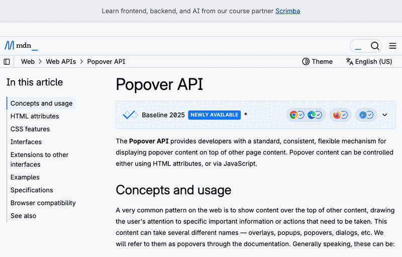
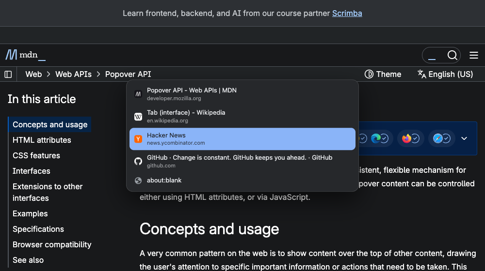
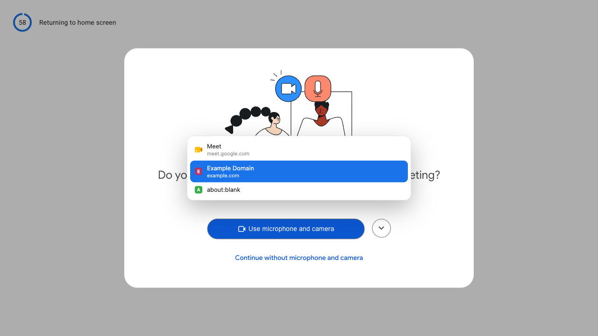

# MRU Tabs

`Ctrl+Tab` walks your Chrome tabs in the order you actually used them, and lands
when you let go.



## The tab you want is never the tab on the right

Chrome's `Ctrl+Tab` moves one tab to the right along the strip. That is where
the tab sits, not when you last used it, so bouncing between the two things you
are working on means hunting along a row of favicons every time.

`Alt+Tab` on your desktop has never worked that way. It walks the windows in the
order you used them, the one you want is first, and letting go of the key is how
you choose. This puts that in the browser.

## What you do

One gesture, two speeds, separated by a timer.

```text
tap and let go                        hold
────────────────────────────────      ────────────────────────────────
  0ms  Ctrl+Tab                         0ms  Ctrl+Tab
 80ms  release → previous tab         180ms  the list appears
                                      340ms  Ctrl+Tab → second row
 no list is ever drawn                520ms  Ctrl+Tab → third row
                                      900ms  release  → third row
```

`Ctrl+Shift+Tab` walks back up the list. `Escape` closes it and leaves you where
you were. A tab that opens while you are looking at something else — a
middle-clicked link, a background `target=_blank` — lands one step away, so a
single `Ctrl+Tab` reaches it.

The switch always happens on release, which is also the moment you decided, so
the quick path has no lag to lose.

 

Light and dark follow the system. The list draws in the browser's top layer, so
it comes out above a modal dialog or a fullscreen video — the right-hand shot is
Google Meet's own permission prompt, which sits in that layer and hides anything
stacked normally.

## It cannot get stuck

Switchers like this usually open a small window and read the keyboard from
there. Creating and focusing a window takes time, and your release only counts
if something the extension owns holds the keyboard at that instant. Let go
inside that gap and the key lands on the page you came from, where nothing is
listening: the window stays open and no tab switch happens.

There is no window here. The list is drawn by a script already loaded in the tab
you are looking at, which already has your keyboard. Four things end a gesture,
so none of them can leave it hanging:

| situation | what ends it |
|---|---|
| ordinary | you release `Ctrl` |
| the modifier cannot be read, one tap | 250 ms — a flick, so it lands at once |
| the modifier cannot be read, still walking | 1.2 s after your last tap |
| anything else | a 10 s ceiling |

The modifier cannot be read when your keyboard focus sits somewhere no extension
can follow — DevTools is the one you will actually meet. Switching still works
there; a timer rather than your thumb decides when.

On pages Chrome forbids extensions from touching at all — `chrome://`, the Web
Store, the PDF viewer, the new tab page — each tap switches immediately with no
list. Land somewhere ordinary and the list picks up from the next tap.

## What it never does

For a tool that watches every keystroke on every page, the list of things it
does not do matters more than the feature list.

- **It never sends anything anywhere.** No servers, no analytics, no network
  requests of its own at all.
- **It never stores your browsing.** The recency order is tab ids in memory,
  mirrored to `chrome.storage.session`, which Chrome clears when it quits.
  Nothing reaches disk.
- **The page cannot read your tabs.** The list is drawn into a closed shadow
  root, and icons come from Chrome's own favicon store over an extension URL, so
  the page never sees a request revealing where else you have tabs open.
- **The page cannot drive it.** Key events that a page invents are rejected, so
  a site cannot hold the modifier down for you or pick where you land.

Two things a page can still tell, because the list is drawn in its document:
that the extension is installed, and the moment of each switch.

## Install

Not on the Web Store — load it unpacked.

1. `chrome://extensions` → Developer mode on → **Load unpacked** → this folder.
2. `chrome://extensions/shortcuts` → check the two commands. macOS comes bound
   to `Ctrl+Q` and `Ctrl+Shift+Q`; elsewhere the defaults are `Alt+Q` and
   `Alt+Shift+Q`, because Chrome will not take `Ctrl+Q` there.

Those defaults exist because Chrome refuses to bind `Ctrl+Tab` at all. If you
want the real key, see below; otherwise a key remapper pointed at whichever
shortcut you bound works fine.

## Binding the real Ctrl+Tab

Chrome rejects `Ctrl+Tab` in a manifest and in the shortcuts page: `Tab` came off
the list of bindable keys in Chrome 33 for accessibility, and the browser handles
the combination before any extension sees it.

That rule lives in the settings UI, not in the machinery underneath it.
`chrome.developerPrivate` is the internal API that page calls when you type a
shortcut into it, and it sets `Ctrl+Tab` without complaint. Chrome then honours
it, across restarts and extension reloads.

Open `chrome://extensions/shortcuts`, open the console for that page, and paste
[`tools/bind-ctrl-tab.js`](tools/bind-ctrl-tab.js). It finds the extension by
name — an unpacked extension's id comes from its folder path, so it moves when
the folder does — binds both directions and reads the result back.

Two costs, both real. It is a private API, so a Chrome release could take it
away; a key remapper is the fallback. And you spend Chrome's own `Ctrl+Tab` and
`Ctrl+Shift+Tab` to get it — `Cmd+Opt+←/→` still steps one tab along.

## How it is put together

```text
src/
├── mru.js        # the recency order, as pure list operations
├── session.js    # one gesture's state machine, pure
├── sw.js         # Chrome events, tab activation, message routing
├── content.js    # keyboard capture, in every frame
└── overlay.js    # draws the list, top frame only
```

`mru.js` and `session.js` hold every decision worth testing and name no browser
API, so they run under `node --test` with no Chrome at all.

## Tests

```bash
npm install
npm test            # the pure modules, no browser
npm run test:e2e    # the real extension in a real Chromium, headless
```

The end-to-end suite loads the unpacked extension into Playwright's Chromium and
drives real key events through `chrome.commands.onCommand` — the same listener
your keyboard reaches. It covers the quick tap, the held list, the backward
step, a page that calls `stopImmediatePropagation` on every keyboard listener it
can register, a page serving a `strict-dynamic` CSP, a page holding the top layer
with a modal dialog, a page inventing key events to steer the gesture, a page
watching for icon fetches to learn where else you have tabs open, a tab that
closes mid-gesture, and a blind step from `chrome://version`.

Chrome 152 and later ignore `--load-extension`, which is why the suite runs in
Playwright's bundled Chromium rather than your installed Chrome.

## Licence

MIT.
